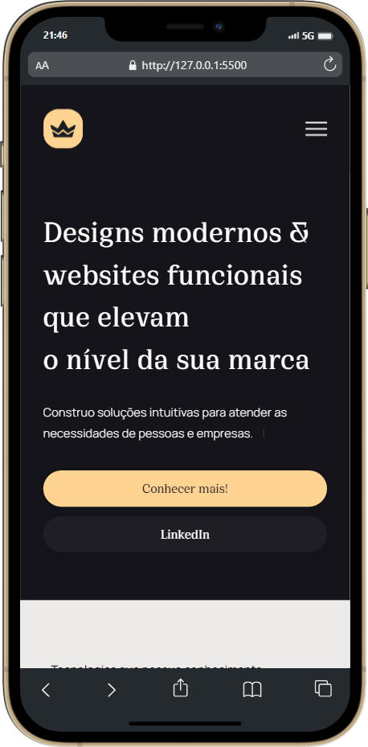
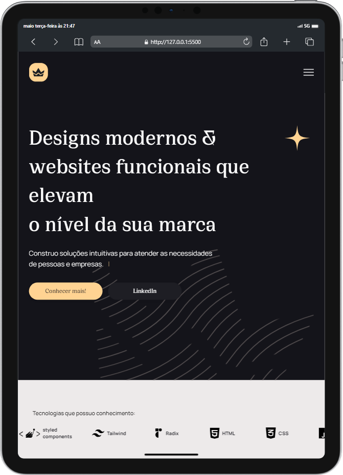

<h1 align="center">
 Portfólio - larisn
</h1>
 

<h3 align="center">
👑 Preview - Desktop
</h3>

 
 

<h3 align="center">
👑 Preview - Mobile e Tablet
</h3>
 

&ensp; &ensp; &ensp; &ensp; &ensp; &ensp; &ensp; &ensp; &ensp; &ensp; &ensp; &ensp; &ensp; &ensp; &ensp;  &ensp; &ensp; &ensp; 
 
 

  
<a href="https://larisn.vercel.app/">Clique para ir para o portfólio</a>

## ✨ Seções
O site possui sete partes:

- **Home:** Nessa parte é uma breve apresentação do site.
- **Serviços:** Apresento alguns dos serviços que ofereço.
- **Trabalhos:** Apresento alguns dos meus projetos com link direto para eles.
- **Sobre mim:** Essa seção fala um pouco sobre mim.
- **Perspectiva:** Essa seção fala sobre alguns valores que levo pra vida.
- **Contato:** Possui um formulário de contato para entrar em contato diretamente comigo.
- **Submissão do formulário:** Possui uma página de feedback ao usuário ao enviar o formulário de contato.
 

---

## 💻 Tecnologias utilizadas:

Para o desenvolvimento deste site utilizei as seguintes tecnologias:

* HTML
* Sass
* JavaScript
* AOS
* Figma

---

## 🎐 Licença
Esse projeto está sob licença. Clique no arquivo [LICENÇA](https://github.com/larisn/larisn/blob/main/LICENSE.md) para ver mais detalhes.

 

---

Feito com 💛 by larisn
